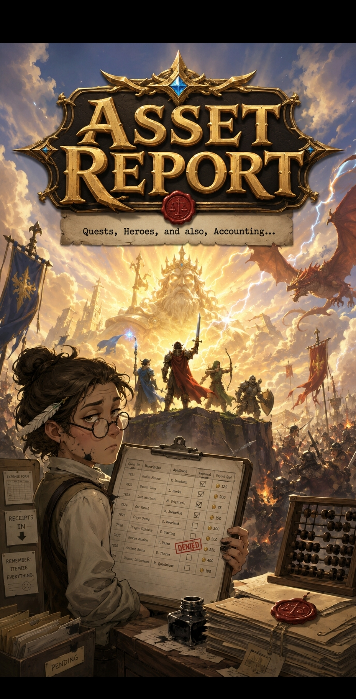

# Asset Report — Game Art Bible

> **Status:** Canonical for the game *Asset Report*. This is the master document
> for the game's visual identity: **what exists**, **how every map node is built**,
> **how visuals map into the ArtLibrary DAM**, and **how `Sluborg/game` consumes
> them**. It is usable by **both an image generator and a developer** — prefer the
> tables and explicit IDs below over prose.
>
> **How rendering is split:**
> [`StyleGuides/AssetReport-v1.md`](../../StyleGuides/AssetReport-v1.md) is the
> game-specific, generation-ready style guide derived from the title screen (the
> per-visual pin: palette, lighting, brush, negative prompts). The library's
> broader parent guide is
> [`StyleGuides/Fantasy-Strategy-v1.md`](../../StyleGuides/Fantasy-Strategy-v1.md).
> Read the style guide for *how to render*; read this bible for *what to make*.
>
> **Load order for a fresh Lubot chat:**
> 1. [`Studio.md`](../../Studio.md) · 2. [`WORKFLOW.md`](../../WORKFLOW.md) ·
> 3. [Asset Report Style Guide](../../StyleGuides/AssetReport-v1.md) ·
> 4. [Fantasy Strategy Style Guide](../../StyleGuides/Fantasy-Strategy-v1.md) ·
> 5. **GameArtBible (this file)** · 6. [`Buildings.md`](Buildings.md) ·
> 7. [`Resources.md`](Resources.md) · 8. [`Icons.md`](Icons.md) ·
> 9. [`UI.md`](UI.md). [`Moodboards.md`](Moodboards.md) and
> [`VisualLanguage.md`](VisualLanguage.md) support all of the above.

---

## Glossary — "visual" vs. "asset" (read first)

The word **"asset" is a core game concept** in *Asset Report* (quests, ledger
line-items, requisitions, in-fiction property — the things the clerk *itemizes*).
To avoid collision, this folder uses a disambiguated vocabulary:

| Term | Meaning |
| --- | --- |
| **visual** (a.k.a. *art asset*) | A media file stored in **ArtLibrary** — an image/illustration/icon governed, hashed, metadata-described and indexed by the DAM. **This is what we author.** |
| **asset** (game term) | The in-fiction / game-domain concept — a quest, a ledger item, a tracked piece of realm property. **Never** used here to mean a file. |

- **`asset-index.json` is the DAM's index of *visuals*** — it is *unrelated* to the
  game's in-fiction assets. The name is repo infrastructure, not game vocabulary.
- **Repo infrastructure names are load-bearing and unchanged.** `asset-index.json`,
  `ASSET_INDEX.md`, `Metadata/all-metadata.json`, `Scripts/` (the `artlib` package),
  and `.github/workflows/validate-assets.yml` keep their names. The "visual" vs.
  "asset" disambiguation applies only to **prose and new identifiers/column headers**
  that *we* author (e.g. `Buildings.md` uses an **"Art status"** column, never
  "Asset status").

---

## Theme plate — the master theme anchor



> **This title screen is the canonical theme anchor. Everything in *Asset Report*
> inherits its look and tone.** It is committed as a DAM visual and indexed:
>
> - **Repo path:** `Wallpapers/AssetReport/title-screen.jpg`
> - **`raw_url`:** `https://raw.githubusercontent.com/Sluborg/ArtLibrary/main/Wallpapers/AssetReport/title-screen.jpg`
> - **collection:** `AssetReport` · **kind:** `wallpaper`

**The visual identity it sets:**

- **Palette:** warm **gold** dominant, **divine cream-white light** bursting from
  behind the heroes, **blue-gem accents** (the title's inset gems, the royal-blue
  banners), a **deep dark vignette** framing the corners, and warm **parchment**
  neutrals on the desk. Exact hex values live in
  [`StyleGuides/AssetReport-v1.md`](../../StyleGuides/AssetReport-v1.md).
- **Rendering:** **painterly, illustrative, semi-realistic** — confident brushwork
  that resolves to crisp readable forms. Not flat-vector, not photoreal, not
  cartoon.
- **Framing:** **ornate engraved metalwork** — the gold title plate with filigree,
  gem inlays, and a red wax seal is the north star for all UI frames and badges.
- **Mood & tone:** **epic high-fantasy clashed with mundane bureaucracy.** Glory in
  the background (heroes, a radiant sky-god, a dragon), the weary clerk and the
  ledger in the foreground. Rendered with total sincerity above and dry, affectionate
  comedy below. *"Quests, Heroes, and also, Accounting…"*

A **reference plate** for the map-node system (below) is also committed:
`Illustrations/AssetReport/node-design-sheet.png`
([raw_url](https://raw.githubusercontent.com/Sluborg/ArtLibrary/main/Illustrations/AssetReport/node-design-sheet.png)).

---

## Vision

*Asset Report* is a **kingdom-management game about the people who do the paperwork
of heroism**. While knights raise their swords against dragons and a golden god
watches from the clouds, **you** are the clerk at the desk — stamping quest
approvals, balancing the treasury, itemizing the receipts, and quietly keeping an
entire realm of adventurers solvent.

The player fantasy is **heroic administration**: the satisfying, slightly absurd
power of being the indispensable functionary behind the legend. You never swing the
sword. You *approve the requisition for the sword* — and the realm runs because your
ledgers balance.

Players should feel **competent, wry, and quietly proud**. The mood is the warm
exhaustion of a job well done: the glory is real and visible, but it is happening
*because of* the unglamorous work in the foreground. The art must make the player
love both halves — the splendor of the kingdom **and** the dignity of the desk.

## Core Identity

- **Genre:** kingdom / settlement management with a layer of quest-and-economy
  administration.
- **Identity in one line:** *heroic bureaucratic fantasy* — civilized, organized
  high fantasy seen from behind the clerk's desk.
- **The defining tension:** **epic glory vs. mundane paperwork.** Every key visual
  holds both at once. Heroes, gods, and dragons are rendered with total sincerity
  and grandeur; the comedy and warmth come from *framing* them against ledgers,
  stamps, abacuses, and a tired administrator — never from making the fantasy itself
  look silly.

This is **not** a war game, a dungeon crawler, or a grimdark survival sim. It is
**civilized fantasy** — a functioning realm with a treasury, a guild office, a quest
board, and a very long queue of expense forms.

## Tone

- **Wry, affectionate comedy with genuine grandeur underneath.** The joke is the
  *juxtaposition* (a glowing god-king in the sky, a **DENIED** stamp on the desk),
  not slapstick. Deadpan, dry, bureaucratic humor.
- **Optimism and humanity.** The clerk is sympathetic and dignified — overworked,
  ink-stained, but never a punching bag.
- **Earned wonder.** When the heroes and the divine appear, they are awe-inspiring
  for real, so the desk-work means something.
- **Warmth over edge.** No grimdark, no cynicism, no cruelty.

Emotional register, in order of dominance: **warm wit → quiet pride → measured
wonder → gentle drama.**

## World

- **Technology level:** pre-industrial medieval. Quills, parchment, wax seals,
  abacuses, ledgers, windmills, water-driven forges, hand carts, timber cranes. No
  gunpowder, no clockwork, no steampunk.
- **Magic level:** real but **rare and reserved**. The divine and arcane genuinely
  glow; **only magic emits light, mundane materials never glow** (style-guide rule).
- **Architecture:** a civilized human kingdom — pale weathered stone keeps with
  crenellations; **blue conical/domed roofs with gold finials** on civic and
  landmark buildings; timber-and-plaster on humble working buildings; **red-tiled**
  roofs on the barracks; striped awnings over market stalls. Banners everywhere.
- **Climate & light:** temperate and golden — a perpetual warm late-afternoon with
  god-rays, dust in the light, long warm shadows.
- **Culture:** an **Order/human-kingdom** realm (royal blue + warm gold) with guilds,
  a treasury, a civil service, a quest economy, and clear ranks from clerk to king.
- **Economy:** a coin economy in **gold pieces (gp)**, run through markets and a
  central treasury. Quest payouts, reimbursements, and building costs settle in gp.
- **Religion:** a radiant sky-pantheon — a benevolent luminous god-king in the
  clouds, served by temples and a divine order. Faith is a source of light.

## Architecture language

Keep every new building on-brand:

- **Stone:** pale, warm, weathered ashlar and rubble; crenellated tops on keeps and
  walls; matte and chalky; honest wear, never grime.
- **Roofs (the signature shapes):** **blue** conical spires and domes with **gold
  finials** for civic/royal/scholarly buildings (Home Keep, Grand Citadel,
  Settlement, Academy); **red tile** for military (Barracks); plain grey-slate or
  timber for practical buildings.
- **Wood:** oiled timber framing, plaster infill, scaffolding, cranes, carts,
  palisades on humble/working structures.
- **Scale & progression:** humble → grand reads through silhouette mass and ornament.
  More importance = taller, more towers, more banners, more gold.
- **Banners & heraldry:** blue-and-gold pennants on player/civic structures; red
  heraldic banners on military ones.

---

## Node construction system (canonical — reproduce exactly)

Every building is delivered as a **map node**: a painterly isometric building scene
wrapped in a fixed furniture of **ring + scene + badge + light**. The
[node design sheet](../../Illustrations/AssetReport/node-design-sheet.png) is the
ground-truth reference. The four layers are **identical on every node** except the
themed scene and the badge icon — that consistency is what makes the whole map read
as one system.

| # | Layer | Spec (keep identical across all nodes unless noted) |
| --- | --- | --- |
| 1 | **Base Ring** | A circular **gold ring**, **consistent for all** nodes. Polished engraved-plate gold with the warm key light from upper-left; a sprig of green **laurel/foliage** clasps the lower-left and lower-right of the ring. The ring is the shared frame. |
| 2 | **Themed Scene** | The building itself — a **3/4 isometric-from-above** painted scene that **sits inside and slightly overlaps/breaks the top edge of the ring** so it reads as three-dimensional. Stands on a **small rounded terrain base** (earth/grass/stone) at the foot of the ring. Only this layer changes per building. |
| 3 | **Top Badge** | A small **circular gold-rimmed badge** centered at the **top** of the ring, slightly overlapping it, carrying the **node-type identifier icon** (hammer, stone, wheat, tome, scales, …). **Two exceptions, both shown on the reference sheet:** (a) **Military/Defense** nodes use a **red heraldic banner-shield badge** instead — the badge *frame shape* encodes the category; (b) **Civic/Player** nodes (Home Keep, Grand Citadel, Settlement) carry their type identity as a **blue-and-gold pennant flown in the building scene** rather than a circular top badge — the `Buildings.md` roster lists this as their "Blue pennant" top-badge entry. When a civic node does use a circular badge, it carries the faction sigil/star. See [`Icons.md`](Icons.md). |
| 4 | **Rim Light** | A warm, "epic" **rim light** along the building's upper edges, lifting it off the background. *Epic warm theme*, consistent across all nodes. |

> **Backdrop:** a **deep near-black warm field** so the gold ring and rim light pop.
> The building never fights the ring; the ring never fights the badge.
> **Emission rule:** only the **Temple** (and any divine/arcane element) emits light.

**Building families** (each family fixes roof color, banner, badge frame, and scene
props — full per-building spec and the needed/done worklist live in
[`Buildings.md`](Buildings.md)):

| Family | Category | Examples | Reads as |
| --- | --- | --- | --- |
| Civic / Player core | `PLAYER_BASE`, `LANDMARK`, `CIVIC` | Home Keep, Grand Citadel, Settlement | Blue-and-gold stone, crenellations, the player's identity |
| Resource extraction | `RESOURCE` | Lumber Camp, Quarry, Farmland, Iron Mine, Gold Mine | Working timber-and-stone, tools and raw material on show |
| Research / Craft | `RESEARCH`, `CRAFTING` | Academy, Forge | Domed scholarship vs. fire-lit industry |
| Military / Defense | `MILITARY`, `DEFENSE` | Barracks, Archer Tower, Wall | Red banners, drilled and fortified |
| Economy | `ECONOMY` | Market | Striped awnings, stalls, goods, coin |
| Divine | `DIVINE` | Temple | Radiant — the only building that emits light |

---

## Naming & metadata conventions (how visuals map into the DAM)

Every *Asset Report* visual is a governed DAM file. Author its metadata to match the
ArtLibrary schema in [`README.md`](../../README.md) so it indexes and validates.

**Stable IDs (slugs).** Each game subject has one **kebab-case slug** that is its
permanent identifier (`home-keep`, `lumber-camp`, `archer-tower`). The slug is the
join key between art and game code; it never changes once published.

**Filenames** (lower-case, slug-based, no spaces):

| Visual type | Pattern | Example | Target dir (indexed) |
| --- | --- | --- | --- |
| Title / key art | `title-screen.<ext>` / `<slug>.<ext>` | `title-screen.jpg` | `Wallpapers/AssetReport/` |
| Building map node | `node-<slug>.png` | `node-home-keep.png` | `Illustrations/AssetReport/` |
| Reference / moodboard | `<slug>.png` | `node-design-sheet.png` | `Illustrations/AssetReport/` |
| Type badge | `badge-<slug>.png` | `badge-lumber.png` | `Icons/AssetReport/` |
| Resource icon | `icon-resource-<type>.png` | `icon-resource-wood.png` | `Icons/AssetReport/` |
| UI icon (small glyph) | `ui-<name>.png` | `ui-stamp-approved.png` | `Icons/AssetReport/` |
| UI frame / plaque | `ui-<name>.png` | `ui-building-nameplate.png` | `Assets/AssetReport/` |

> **Why not under `Games/`?** The DAM's `discover_assets()` only walks the asset
> folders (`Assets, Icons, Illustrations, Wallpapers, Textures, Generated`). Files
> under `Games/` are **not** indexed and get **no `raw_url`**, so every visual the
> game consumes must live in an asset folder. The `.md` docs stay here in `Games/`.

**Required metadata block** (authored; the index adds `sha256`/`raw_url`/etc.):

```jsonc
{
  "kind": "wallpaper",                 // REQUIRED identity (icon|illustration|wallpaper|texture|...)
  "title": "Asset Report - Title Screen",
  "description": "...",
  "collection": "AssetReport",         // groups every Asset Report visual
  "tags": ["asset-report", "key-art", "title-screen"],  // always include "asset-report"
  "license": "internal-game-art",
  "generator": "unknown",              // be honest; never fabricate a seed
  "prompt": "unknown - original prompt not recorded"
}
```

- **`collection: "AssetReport"`** on every Asset Report visual — the query handle for
  "all of this game's art".
- **`kind`** is required (validation fails without it): building nodes are
  `illustration`, the title screen is `wallpaper`, badges/resource/UI marks are
  `icon`.
- **Tags** always include `asset-report`, plus the family/type (`building-node`,
  `resource`, `ui`, `badge`) and the slug where useful.
- **Provenance honesty:** if the true prompt/generator is unknown, record
  `"unknown"` / `"unknown - original prompt not recorded"`. A plausible-but-fake
  prompt poisons the DAM's reproducibility contract.
- **Keep embedded metadata ASCII-safe.** JPEG EXIF (`ImageDescription`) is not
  Unicode-safe, so non-ASCII characters (em dashes, curly quotes) round-trip to
  `?` in the index. Use plain ASCII punctuation in stored titles/descriptions/prompts;
  PNG/SVG embed UTF-8 fine, but keep them ASCII too so a visual's metadata reads
  identically across formats.

---

## Integration / engineering — for a `Sluborg/game` developer

**The contract:** the game treats **`asset-index.json` as its art manifest**. It
reads the index, filters `collection == "AssetReport"`, and loads each entry's
**`raw_url`** (`https://raw.githubusercontent.com/Sluborg/ArtLibrary/main/<path>`)
at the point of use. **Visuals are referenced, never copied into the game repo.** The
two repos do not otherwise depend on each other.

```text
asset-index.json  ──read──▶  game filters collection=="AssetReport"
                              looks up by slug (tags / filename)
                              loads entry.raw_url  ──▶  texture/sprite
```

**Shared vocabulary — PROPOSED, for the game team to ratify.** These IDs/enums let
art and code use one vocabulary. They are **proposed from the art side and flagged
for confirmation by whoever codes `Sluborg/game`** — not locked canon. Three of them
are genuine game-design decisions (see also the PR's ASSUMPTIONS):

- **`NodeType`** — kebab-case slugs, one per building. The DAM stores them as slugs;
  game code may map to its own `HOME_KEEP`-style enum. **Decision to confirm.**
  ```
  home-keep · grand-citadel · settlement · lumber-camp · quarry · farmland ·
  iron-mine · gold-mine · academy · forge · barracks · archer-tower · wall ·
  temple · market
  ```
- **`Category`** — the task's 9 categories **plus a proposed `CIVIC`** to hold
  *Settlement* (Village/Watchpost), which fits neither `PLAYER_BASE` nor `LANDMARK`
  cleanly. **Decision to confirm.**
  ```
  PLAYER_BASE · LANDMARK · CIVIC · RESOURCE · RESEARCH · CRAFTING ·
  MILITARY · DEFENSE · DIVINE · ECONOMY
  ```
- **`ResourceType`** — the full proposed set, including the bureaucracy resources
  that match the game's "itemize everything" identity. **Decision to confirm.**
  ```
  WOOD · STONE · FOOD · IRON · GOLD · KNOWLEDGE · FAITH · APPROVAL
  ```

The per-node mapping (slug → category → badge → role → target file → `raw_url`) is
the table in [`Buildings.md`](Buildings.md), which doubles as the art worklist.

---

## Categories (the visual collections this game accumulates)

- **Splash / key art** — the glory-vs-paperwork hero images (the title screen is the
  template). → `Wallpapers/AssetReport/`
- **Buildings (map nodes)** — the Base-Ring building set; the largest collection. →
  `Illustrations/AssetReport/`
- **Type badges**, **Resource icons**, **UI icons** — the icon families. →
  `Icons/AssetReport/`
- **Characters** — heroes (knight, mage, ranger, fighter) and the civil service
  (clerks, treasurer, merchants, the king).
- **Creatures** — the dragons and monsters quests are filed against.
- **Documents** — ledgers, quest forms, expense reports, seals, stamps (a category
  almost unique to this game).
- **Loading screens / divine moments** — radiant sky-god and faith imagery.

## Visual storytelling

- **Glory/paperwork split.** Foreground = your job (desk, documents, decisions);
  background = the consequence (heroes, realm, gods). Composition teaches "your small
  actions fund the legend."
- **Buildings communicate function** through roof color, banner, badge, and props.
- **Color communicates meaning:** **blue + gold = civic/player/Order**, **red =
  military/defense**, **gold-neutral = resource/economy/currency**, **radiant warm
  light = divine/faith**, **grey-brown parchment = the neutral working world**.
- **Light communicates value:** warmer/brighter = more glorious. The desk is cooler
  and muted; heroes and the god are bathed in the warm key light.

## Things to avoid

- Grimdark, gore, horror, bleakness. · Zany cartoon / slapstick rendering (the humor
  is deadpan and *framed*; the fantasy is drawn straight). · Sci-fi, steampunk,
  clockwork, gunpowder. · **Modern** office clichés (staplers, fluorescent light,
  cubicles, sticky notes) — the bureaucracy is **fantasy-medieval** (quills, wax,
  ledgers, abacus). · Neon, rainbow, oversaturation, photoreal/3D-render look. ·
  Glowing mundane objects (only divine/arcane emit). · Cluttered, noisy compositions
  that bury the focal point. · Cold, sterile, corporate minimalism.

## Future expansion

The Civil Service roster (clerks, Treasurer, Quartermaster, Auditor, Tax Collector,
Royal Scribe) · a Document & stationery set (forms, writs, decrees, a stamp library:
APPROVED/DENIED/PENDING/OVERDUE) · building upgrade tiers per family · quest creatures
& encounters · faction variants (style-guide Wild/Arcane keys, filtered through the
bureaucratic lens) · seasonal/event key art (audit season, tax day) · the Divine &
faith collection (the emissive set).
